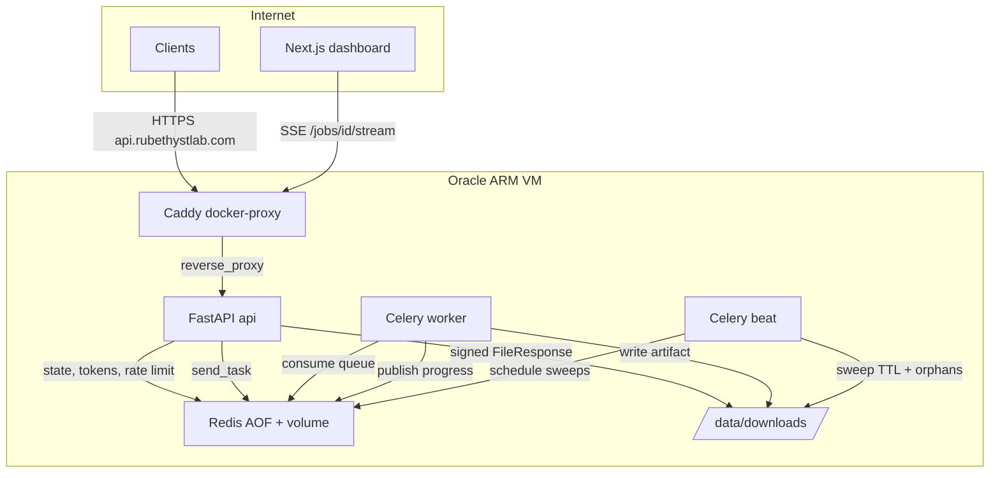

# Arquitetura

Rubethyst Snap é um motor de download multi-plataforma exposto como
SaaS com três faces sobre o mesmo núcleo:

* **Library** (`rubethyst_snap.core`) — funções puras `download` e
  `extract_metadata`, sem HTTP, sem Redis, sem UI.
* **API** (`rubethyst_snap.api`) — FastAPI versionada em `/api/v1`,
  responsável por enfileirar jobs, expor SSE de progresso e servir
  ficheiros via URL assinada.
* **Worker** (`rubethyst_snap.worker`) — Celery worker + Beat que
  executa downloads, publica progresso em Redis Pub/Sub e mantém o
  disco limpo.



## Componentes

| Plano | Componente | Função |
|-------|------------|--------|
| Cliente | Next.js / curl / desktop | UI, integrações |
| Controle | Caddy + FastAPI | TLS, reverse-proxy, validação, anti-leech |
| Dados | Celery + Redis | fila durável, retries, Pub/Sub, estado |
| Storage | Volume `downloads` | artefactos locais, lidos pela API com token |

## Fluxo de um job

1. `POST /api/v1/preview` (opcional) — UI mostra título/duração antes
   de cobrar quota.
2. `POST /api/v1/jobs` — middleware aplica plano, rate limit e
   concorrência; cria registo no Redis e enfileira `download_job` no
   queue do plano.
3. Worker chama `core.download`, atualiza `JobRepository` e publica
   `ProgressEvent` em `snap:job:{id}:progress` (Pub/Sub).
4. Cliente assina `GET /api/v1/jobs/{id}/stream` (SSE); recebe eventos
   ao vivo até `finished` ou `error`.
5. Quando concluído, cliente chama `POST /api/v1/jobs/{id}/download-url`
   para obter um JWT efêmero e baixa em
   `GET /api/v1/jobs/{id}/file/{filename}?token=...`.
6. Beat remove o artefacto após `retention_until` vencer e varre
   órfãos restantes a cada hora.

## Persistência e durabilidade

* **Redis** com `--appendonly yes` e volume montado: sobrevive a
  reboots da VM; broker Celery, índice de jobs, cotas e tokens não se
  perdem.
* **JobRepository** (`rubethyst_snap.jobs.repository`) é uma `Protocol`;
  a implementação atual é `RedisJobRepository`. Para histórico durável
  e billing, basta plugar uma versão SQLite ou PostgreSQL sem mexer no
  resto.

## Anti-leech

A API nunca expõe links estáticos para o volume:

1. O endpoint de descoberta devolve apenas `download_url` assinada.
2. O JWT (HS256) tem `sub=job_id`, `filename`, `identity`, `exp ~1h`.
3. O endpoint `file/{filename}` valida o token antes do `FileResponse`.
4. Caddy só faz reverse-proxy para a API; não há `file_server`
   apontando para `/data/downloads`.

Modo alternativo (não default): Caddy `forward_auth` para um endpoint
da API que valida o token sem servir bytes — útil se quisermos delegar
o IO ao Caddy. Documentado como opção em `docs/OPERATIONS_ORACLE.md`.

## Cemitério (Beat)

`sweep_expired_artifacts` apaga pastas vencidas pela retenção do plano.
`sweep_download_cemetery` é o safety net: percorre `/data/downloads`,
descarta pastas órfãs com mtime > `RUBETHYST_CEMETERY_ORPHAN_AGE_HOURS`
e remove leftovers (`.part`, `.ytdl`, `.frag`, `.tmp`) mesmo dentro de
jobs ativos quando estão obviamente abandonados.

## Local development

```powershell
docker compose up -d                      # apenas Redis (AOF)
copy .env.example .env
.\.venv\Scripts\python.exe -m pip install -e ".[api,dev]"
.\.venv\Scripts\python.exe -m rubethyst_snap.api.main      # terminal 1
celery -A rubethyst_snap.celery_app worker -l info         # terminal 2
celery -A rubethyst_snap.celery_app beat -l info           # terminal 3 (opcional)
```

> Celery não roda multi-process no Windows; em dev local prefira
> `celery -A rubethyst_snap.celery_app worker --pool=solo` ou rode o
> worker dentro do container Linux.

## Próximos passos

* Plug a `JobRepository` SQLite para auditoria/billing duráveis.
* Métricas Prometheus (`prometheus-fastapi-instrumentator` na API,
  `celery-prometheus-exporter` para o worker).
* Ponte de fan-out para SSE quando o número de listeners por job
  crescer (worker leve com `redis-py` async).
